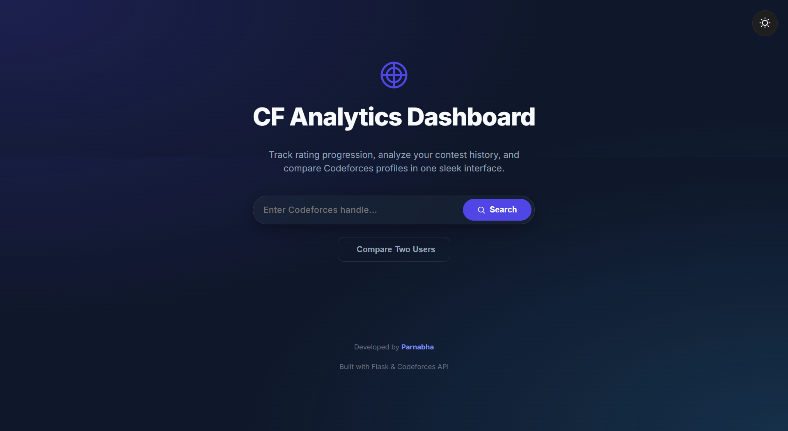
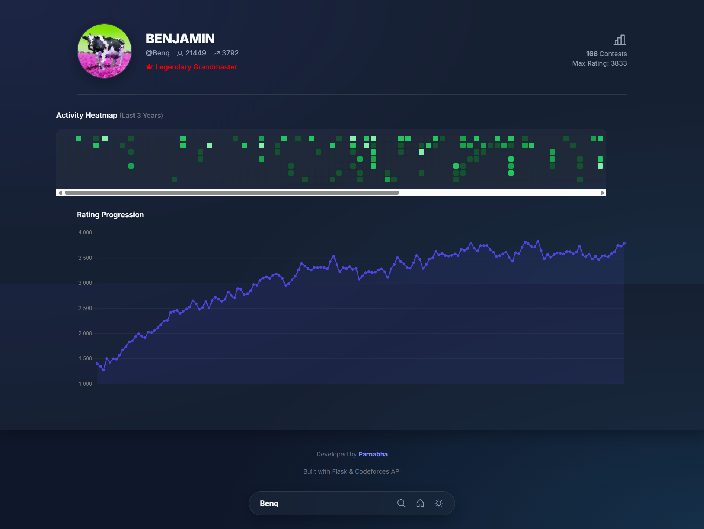
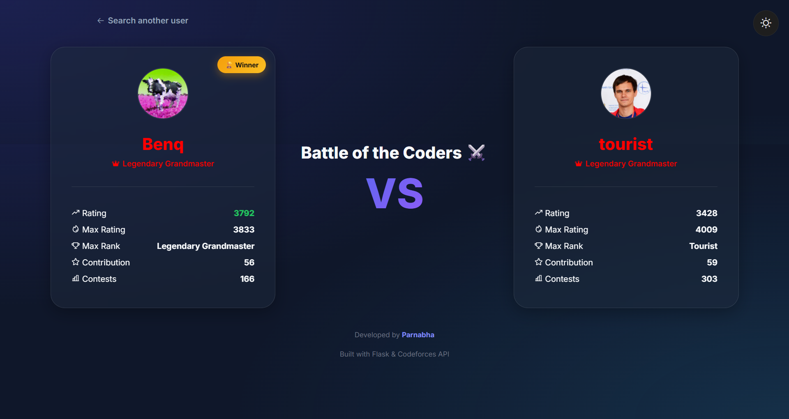

# CF Analytics Dashboard

A modern and interactive Codeforces analytics dashboard built using Flask and the Codeforces API. The application provides detailed insights into user profiles, rating history, activity patterns, and profile comparisons through an intuitive and responsive interface.

## Features

* 🔍 Search Codeforces users by handle
* 👤 View detailed profile information
* 📈 Interactive rating progression graph using Chart.js
* 🔥 GitHub-style activity heatmap for the last 3 years
* ⚔️ Compare two Codeforces users side by side
* 🏆 Automatic winner detection based on rating
* 🌙 Dark/Light theme with persistent user preference
* 📱 Fully responsive design for desktop and mobile devices
* ⚡ Real-time data fetched from the Codeforces API
* 🚨 Graceful error handling for invalid users and network issues

## Tech Stack

### Backend

* Python
* Flask

### Frontend

* HTML5
* CSS3
* JavaScript

### Libraries & APIs

* Chart.js
* Requests
* Codeforces API

### Tools

* Git
* GitHub
* VS Code

## Project Structure

```text
CF-Analytics-Dashboard/
│
├── app.py
├── requirements.txt
├── .gitignore
│
├── static/
│   └── style.css
│
├── templates/
│   ├── index.html
│   ├── profile.html
│   └── compare.html
│
├── index.png
├── profile.png
└── compare.png
```

## Installation

Clone the repository:

```bash
git clone https://github.com/parnabhakahali123/CF-Analytics-Dashboard
cd CF-Analytics-Dashboard
```

Install dependencies:

```bash
pip install -r requirements.txt
```

Run the Flask application:

```bash
python app.py
```

Open your browser and visit:

```text
http://127.0.0.1:5000
```

## Screenshots

### Home Page



### Profile Dashboard



### User Comparison



## Developed By

**Parnabha**

Built with ❤️ using Flask and the Codeforces API.
